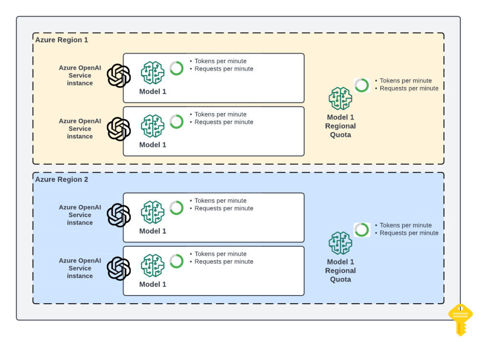
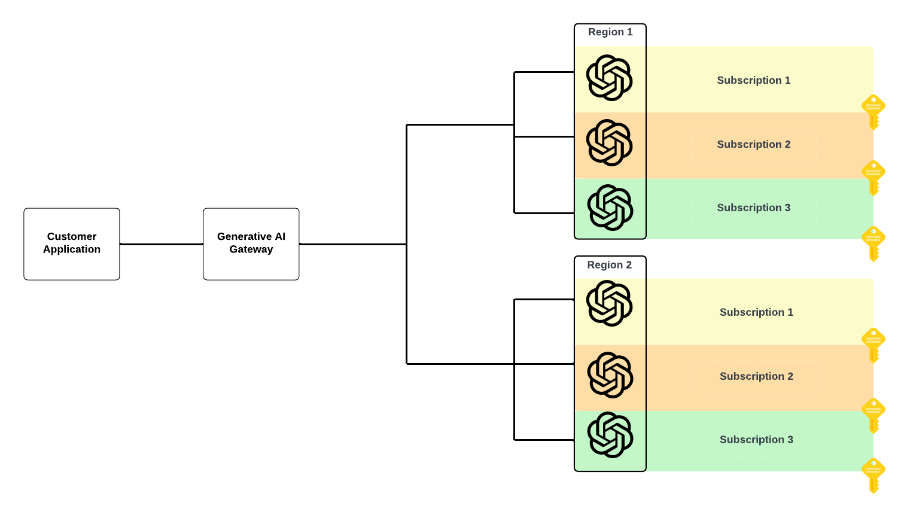
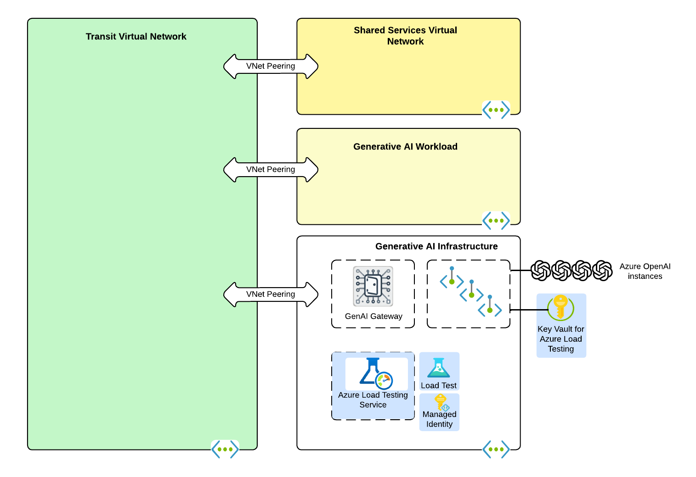
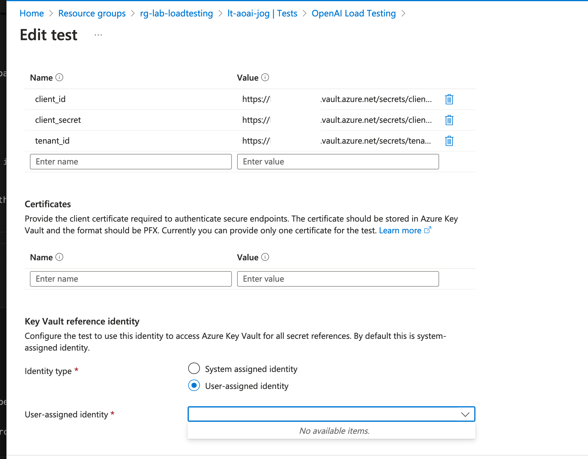
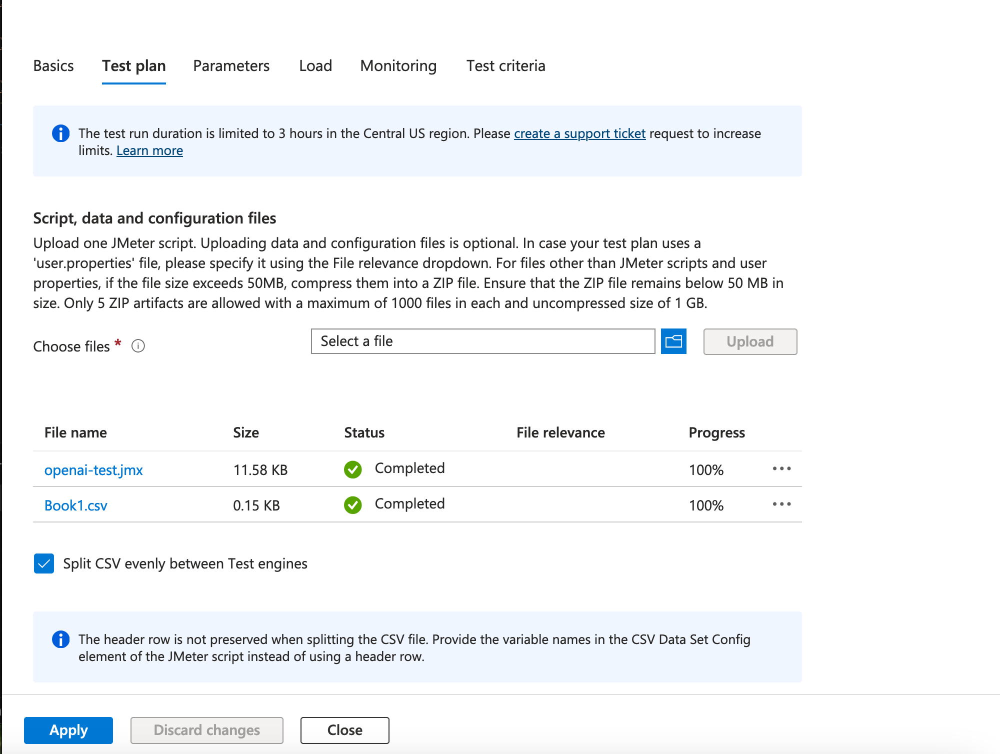
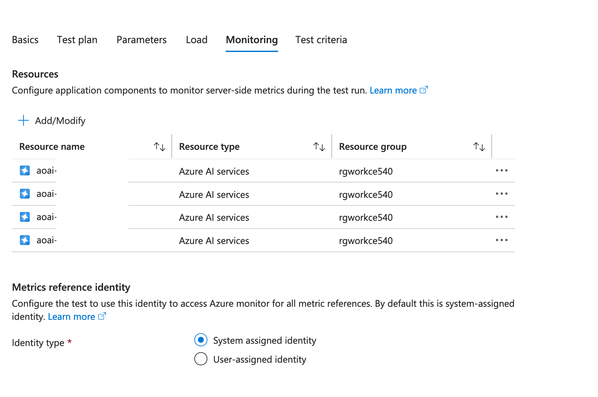

# Azure OpenAI and Azure Load Testing

## Overview
The Azure OpenAI Service provides organizations with access to OpenAI models that are hosted in the Microsoft Azure cloud. Each Azure OpenAI Service instance [has a limited amount of quota](https://learn.microsoft.com/en-us/azure/ai-services/openai/quotas-limits#regional-quota-limits) it has access to for each model within each region within a given subscription as seen in the image below.

While the quota a single instance can provide will often work for proof-of-concept or small workloads, it does not scale for a production enterprise deployment of Generative AI across an organization. To get access to more quota, organizations will [load balance](https://journeyofthegeek.com/2024/05/23/azure-openai-service-load-balancing/) across multiple instances of Azure OpenAI Service across multiple regions and subscriptions using a Generative AI Gateway. A Generative AI Gateway is typically a traditional API Gateway with generative AI-specific functionality built on top such as token throttling, prompt and response caching, and token usage tracking.

It's important that organizations validate the Generative AI Gateway and Azure OpenAI instances provide the required quota needed for the organization. The [Azure Load Testing](https://learn.microsoft.com/en-us/azure/load-testing/overview-what-is-azure-load-testing) service is an Azure-native service that can be used to load test this deployment as well other components of a Generative AI workload such as an index like Azure AI Search. The service execute [Apache JMeter](https://jmeter.apache.org/) load tests to emulate the production use of these services.

This repository contains a collection code to help organizations load test an Azure OpenAI deployment. It consists of:

* Terraform code which deploys the core components of the solution
* Sample JMeter Test that makes calls to the ChatCompletion API
* Sample CSV file containing a structure for providing system prompts, user prompts, and specifying max tokens
* YAML configuration file which will configure a test within the Azure Load Testing service using the sample JMeter test

## Architecture
The code in this lab will create an Azure Load Testing instance that is injected into an organization's existing virtual network. An Azure Key Vault instance is deployed behind with a Private Endpoint into that same virtual network and is integrated with an existing Azure Private DNS Zone. A load test is created within the Azure Load Testing instance using the JMeter sample from this repository.

The image below illustrates a typical architecture this solution could be deployed to. The items in blue are the resources deployed by this code.

## Prerequisites
### General
1. The Microsoft.Batch resource provider [must be registered](https://learn.microsoft.com/en-us/azure/azure-resource-manager/management/resource-providers-and-types).

### Identity
1. The identity used to deploy the Terraform code must be assigned the Owner or Role Based Access Control Administrator role on the subscription.
2. A service principal configured with a client secret (certificate-based credential not supported for this solution). This service principal must be granted the Cognitive Services OpenAI User role on all of the Azure OpenAI Service instances behind the Generative AI Gateway.

### Networking
1. A free subnet that the Azure Load Testing service can use to deploy its test engines for tests.
2. An available subnet to deploy the Private Endpoint for the Azure Key Vault instance. This can be an existing subnet that contains existing Private Endpoints.
3. A Private DNS Zones for privatelink.vaultcore.azure.net that is linked in such a way the engines deployed to the Azure Virtual Network will resolve to these DNS records.

### Azure OpenAI Services
1. Models must be already deployed to the Azure OpenAI Service.

## Setup
#### Terraform deployment
1. [Clone the repository](https://docs.github.com/en/repositories/creating-and-managing-repositories/cloning-a-repository).
2. Create a terraform.tfvars file containing the variables listed below in the /terraform directory. A sample of such of file is provided in this repo and is named sample.tfvars.

  *  key_vault_administrator: The Entra ID object ID of the user or service principal that will run the Terraform code. This allows Terraform to create the client id, client secret, and tenant id secrets in the Azure Key Vault for the service principal used in the load tests.

  * key_vault_private_dns_zone_id: The resource id of the Azure Private DNS Zone for privatelink.vaultcore.azure.net. This Private Endpoint for the Azure Key Vault instance registers its DNS record to this zone.

  * location: The location to deploy the resources to. This must be the same region the virtual network you are using is deployed to.

  * secrets
    * clientid: The client of the service principal that will be used by the load test.
    * clientsecret: The client secret of the service principal that will be used by the load test.
    * tenantid: The Entra ID tenant ID.

  * subnet_id_pe: The resource id fo the subnet the Private Endpoint will be deployed to.

  * tags: Any tags you'd like to add to the resources.

3. Deploy the terraform code.

4. Record the outputs from the Terraform deployment. You will need these for the next step.

### Load Test Configuration
1. In the /config directory you will need to modify the load-test.yaml file. You need to fill in your values for the following variables:
  * Line 27 OPENAI_ENDPOINT: Input the fully-qualified domain name of your Generative AI Gateway.
  * Lines 35-40 TENANT_ID, CLIENT_ID, CLIENT_SECRET: Input the secret references returned from the Terraform output.
  * Line 42 keyVaultReferenceIdentity: Input the value of the load_testing_managed_identity_id output from the Terraform output.

  You can modify additional settings such as the number of engines, virtual users, ramp up time in seconds, and the loop count (number of time each virtual user will perform the ChatCompletions). For every 250 users you should have one engine.

### ChatCompletions
1. Modify the ChatCompletions in config/chat_completions.csv file to include sample system prompts and user prompts specific for your workload. Adjust the max tokens as needed.

### Deploying the Load Test
1. Deploy the load test using the CLI noted in the setup.sh file.

### Post Deployment
The CLI for Azure Load Testing is still in preview and some properties in the YAML configuration for the test may not take.

1. Validate that the identity used by the newly created test is using the user-assigned managed identity created by the Terraform code. To do this you will need to login to the Azure Portal and edit the newly created test. In the Parameters section you must set the field in the screenshot below to the user-assigned managed identity.

2. If you want to split the ChatCompletions in the CSV across multiple engines (if you are testing with more than 250 virtual users) you will need to set that option as pictured below.

3. You can optionally add server-side metrics from the Azure OpenAI instances behind the Generative AI Gateway to track how requests are distributed. These can be added by modifying the section in the screenshot below.

### Running the Test
At this point you should be ready to [run your test](https://learn.microsoft.com/en-us/azure/load-testing/quickstart-create-and-run-load-test?tabs=portal) and test how well your Generative AI Gateway is performing!

